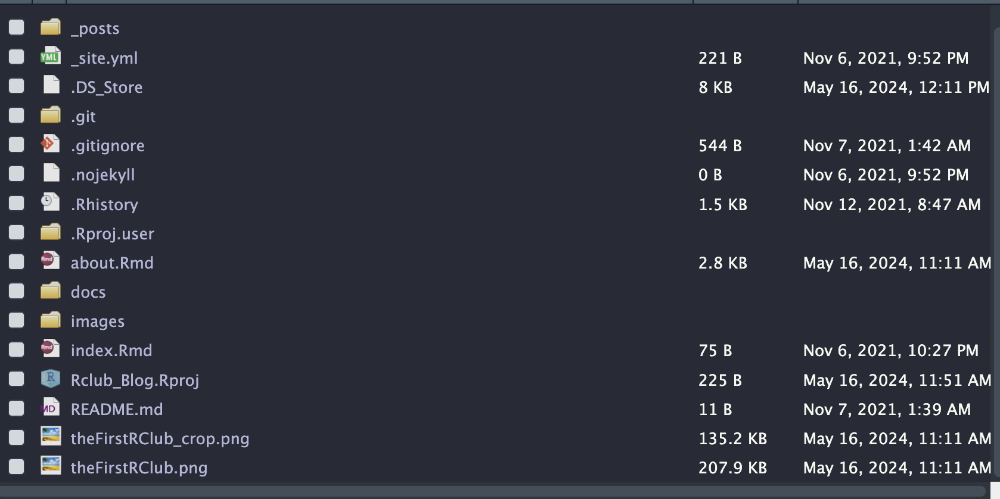

```{r setup, include=FALSE}
knitr::opts_chunk$set(echo = FALSE)
```

A note: I am still learning the distill package and how distill blogs work. The current tutorial is to demonstrate the current workflow I have, and to motivate any R clubbers that want to help to maintain this blog.

# Purpose

To demonstrate how you can start contributing to the R club Blog and archive past R club presentations.

# Who?

Anyone that takes part in R club.

# Getting Started

If you do not already use github/git, then please familiarize yourself with the basics. There are a number of GUI desktop applications that make using github very easy. Unfortunately I will, not cover using github in depth during today's tutorial.

To contribute to the repository you will need to clone the github repository for the blog, and work within the project's directories.

I am assuming you are using R studio. To make everything run smoothly you should make Rmarkdown documents the standard for your R club presentations.

First we will need to install the distill package.

```         
install.packages("distill")
```

This will install the distill package which will allow your work to be formatted in a manner that can be implemented into the blog repository.

The easiest way to create a new blog post is to enter the following command in the directory of the blog

```         
distill::create_post() 
```

This will create a new post in the /\_posts/ directory of the git repository.

i created a new post for this R club (see below):


You can then add in your Rmarkdown file, or create a new Rmarkdown file into this repository.

When beginning a new Rmarkdown file that you intend to have as a blog post, you should use the distill template.


Be sure to format your YAML appropriately. An example is below


You can then run your Rmarkdown as usual.

# Example

The following data and example is based on analysis found at [https://github.com/davestroud/BeerStudyhttps://github.com/davestroud/BeerStudy](https://github.com/davestroud/BeerStudy){.uri}

The authors of this data set were interested in looking at the relationship between alcohol content (alcohol by volume or ABV) and bitterness of beer (IBU).

```{r echo=TRUE}
library(dplyr)
library(readr)
library(magrittr)
library(ggplot2)
Beers <- read_csv("data/Beers.csv")
Breweries <- read_csv("data/Breweries.csv")

Beers <- Beers %>%
  rename(Brew_ID = "Brewery_id")

Beer_data <- left_join(Beers,Breweries, by = "Brew_ID")

```

First we can look at the distribution of IBU (International Bittering Units).

```{r warning=F, echo=TRUE}
Beer_data %>%
  ggplot(aes(x = IBU)) +
  geom_histogram()

```

Most beers fall under 100 IBUs, although some do approach 120+. Many beers do not have IBUs listed.

### We can also look at ABV (alcohol by volume)

```{r echo=TRUE}
Beer_data %>%
  ggplot(aes(x = ABV)) +
  geom_histogram()

```

Most beers are under 10% ABV.

### How does ABV and IBU correlate?

```{r echo=TRUE}
Beer_data %>%
  ggplot(aes(x = IBU, y = ABV)) +
  geom_point() +
  geom_smooth(method = "lm")

Beer_data %>%
  ggplot(aes(x = IBU, y = ABV)) +
  geom_point() +
  geom_smooth(method = "loess")

```

## Which State has the highest median ABV?

```{r echo=TRUE}
Median_ABV_IBU_State <- Beer_data %>%
  na.omit() %>%
  group_by(State) %>% 
  summarise(`Median ABV` = median(ABV, na.rm = T),
            `Median IBU` = median(IBU, na.rm = T)
            )


Median_ABV_IBU_State %>%
  ggplot(aes(x = reorder(State, `Median ABV`), y = `Median ABV`)) +
  geom_bar(stat = "identity") +
  theme(axis.text.x = element_text(size=rel(0.85), angle=90)) +
  xlab("State")
```

## Which state has the highest median IBUs?

```{r echo=TRUE}
Median_ABV_IBU_State %>%
  ggplot(aes(x = reorder(State,`Median IBU`),y = `Median IBU`)) +
  geom_bar(stat = "identity") +
  theme(axis.text.x = element_text(size = rel(0.85), angle = 90)) +
  xlab("State")
```

## Let's Plot it on a Map

Here I plot which state has the highest median ABV using.

```{r echo=TRUE}
library(usmap)

Median_ABV_IBU_State_ <- Median_ABV_IBU_State %>%
  rename(state = "State")

plot_usmap(data=Median_ABV_IBU_State_,values = "Median ABV") +
  scale_fill_gradient2(low = "red",
                       mid = "white",
                       high = "blue",
                       midpoint = 0.053)
```

# After You Finish You Should Knit The Distill Article

This will create an html in our \_post directory, and your post will be updated in the /docs/posts/ directory.


# Checking Your Distill HTML "index.html"


# Final Steps

You need to push to github. We will need to figure out a work flow to have individuals push to the master branch when they have finished putting together their R markdown files. More to come soon.
